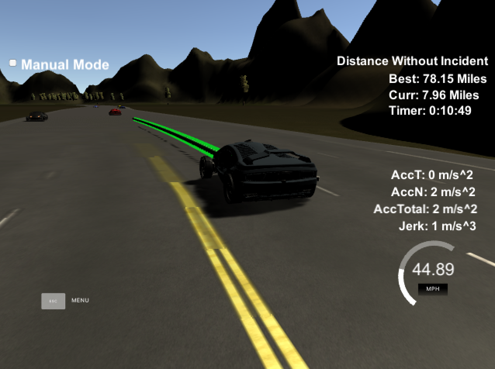

# CarND-Path-Planning-Project
Self-Driving Car Engineer Nanodegree Program

[//]: # (Image References)
[best_run]: ./best_run.png "Best Run"


## Path Planner Documentation

The path planner starts by creating a `Map` object from the `highway_map.csv` file. This map object creates and stores splines for `x`, `y`, `dx`, and `dy` based on the waypoint `s` values. The splines are used to implement a smoother `Map::getXY()` function that converts Frenet coordinates to the map's Cartesian coordinates. 

On each cycle, the planner starts out by building a representation of the road using the sensor fusion data for surrounding vehicles, stored in the `Road` class. A `Vehicle` object is created for the self vehicle and each of the other detected vehicles. The surrounding vehicles are organized into lanes `Left`, `Center` and `Right` based on their detected `d` coordinates. This makes it convenient for the path planner to make decisions based on other vehicles in the self vehicle's own lane, or vehicles in a prospective target lane when attempting to change lanes.

The planner uses the Jerk Minimizing Trajectory technique of generating smooth path points. The `JMT()` function generates a polynomial between a start state and target state, with each state consisting of `{x, x_dot, and x_dot_dot}`. This state represents a coordinate and its rates of change. The polynomial provides a smooth transition function between the two states over a certain time `T`.

Thus, in order to use the JMT function, the planner creates two vectors, start and end, for both the `s` coordinate and `d` coordinate, for a total of four vectors. `start_s` is initialized to the `end_s` of the previous cycle to ensure a continuous smooth trajectory for the vehicle. `end_s` is determined based on the `target_speed` of the vehicle, which accounts for the proximity to vehicles in the current lane. Similarly, the `end_d` is determined based on lane keep or lane change decisions, which will often simply equal `start_d`. 

A trajectory is created for a two second horizon ahead. The `generateNewPoints()` function calculates points based on the JMT polynomials for `s` and `d`, and finally converts the coordinates to `(x, y)` coordinates to feed into the simulator.

The planner uses the `FSM` class to make action decisions based on the current cycle's `Road` conditions. The FSM first calls `getValidNextStates()` to determine the valid states from the self vehicle's current lane. This simply entails whether the vehicle can change lanes left and/or right, or keep its current lane. With each valid next state, the FSM calculates an associated cost based the vehicle's distance to the closest other vehicles forward and behind. Vehicles within a certain proximity prevent the self vehicle from moving into that lane. The minimum cost state is returned to the planner in order to calculate the appropriate `end_s` and `end_d` vectors. If the FSM determines no lane change is safe, the planner will slow the vehicle down. 

This planner was able to complete a lap from stationary in a little under six minutes, with a longest incident free run for 78.15 miles. Click the image below to view a sped up version of the run. The video condenses an hour-long run into about seven minutes. [Video](https://youtu.be/B0qrGkCeXx8)

[](https://youtu.be/B0qrGkCeXx8)


## Basic Build Instructions

1. Clone this repo.
2. Make a build directory: `mkdir build && cd build`
3. Compile: `cmake .. && make`
4. Run it: `./path_planning`.

Here is the data provided from the Simulator to the C++ Program

#### The map of the highway is in data/highway_map.csv
Each waypoint in the list contains  [x,y,s,dx,dy] values. x and y are the waypoint's map coordinate position, the s value is the distance along the road to get to that waypoint in meters, the dx and dy values define the unit normal vector pointing outward of the highway loop.

The highway's waypoints loop around so the frenet s value, distance along the road, goes from 0 to 6945.554.

#### Main car's localization Data (No Noise)

["x"] The car's x position in map coordinates

["y"] The car's y position in map coordinates

["s"] The car's s position in frenet coordinates

["d"] The car's d position in frenet coordinates

["yaw"] The car's yaw angle in the map

["speed"] The car's speed in MPH

#### Previous path data given to the Planner

//Note: Return the previous list but with processed points removed, can be a nice tool to show how far along
the path has processed since last time. 

["previous_path_x"] The previous list of x points previously given to the simulator

["previous_path_y"] The previous list of y points previously given to the simulator

#### Previous path's end s and d values 

["end_path_s"] The previous list's last point's frenet s value

["end_path_d"] The previous list's last point's frenet d value

#### Sensor Fusion Data, a list of all other car's attributes on the same side of the road. (No Noise)

["sensor_fusion"] A 2d vector of cars and then that car's [car's unique ID, car's x position in map coordinates, car's y position in map coordinates, car's x velocity in m/s, car's y velocity in m/s, car's s position in frenet coordinates, car's d position in frenet coordinates. 

## Details

1. The car uses a perfect controller and will visit every (x,y) point it recieves in the list every .02 seconds. The units for the (x,y) points are in meters and the spacing of the points determines the speed of the car. The vector going from a point to the next point in the list dictates the angle of the car. Acceleration both in the tangential and normal directions is measured along with the jerk, the rate of change of total Acceleration. The (x,y) point paths that the planner recieves should not have a total acceleration that goes over 10 m/s^2, also the jerk should not go over 50 m/s^3. (NOTE: As this is BETA, these requirements might change. Also currently jerk is over a .02 second interval, it would probably be better to average total acceleration over 1 second and measure jerk from that.

2. There will be some latency between the simulator running and the path planner returning a path, with optimized code usually its not very long maybe just 1-3 time steps. During this delay the simulator will continue using points that it was last given, because of this its a good idea to store the last points you have used so you can have a smooth transition. previous_path_x, and previous_path_y can be helpful for this transition since they show the last points given to the simulator controller with the processed points already removed. You would either return a path that extends this previous path or make sure to create a new path that has a smooth transition with this last path.

## Tips

A really helpful resource for doing this project and creating smooth trajectories was using http://kluge.in-chemnitz.de/opensource/spline/, the spline function is in a single hearder file is really easy to use.

---

## Dependencies

* cmake >= 3.5
 * All OSes: [click here for installation instructions](https://cmake.org/install/)
* make >= 4.1
  * Linux: make is installed by default on most Linux distros
  * Mac: [install Xcode command line tools to get make](https://developer.apple.com/xcode/features/)
  * Windows: [Click here for installation instructions](http://gnuwin32.sourceforge.net/packages/make.htm)
* gcc/g++ >= 5.4
  * Linux: gcc / g++ is installed by default on most Linux distros
  * Mac: same deal as make - [install Xcode command line tools]((https://developer.apple.com/xcode/features/)
  * Windows: recommend using [MinGW](http://www.mingw.org/)
* [uWebSockets](https://github.com/uWebSockets/uWebSockets)
  * Run either `install-mac.sh` or `install-ubuntu.sh`.
  * If you install from source, checkout to commit `e94b6e1`, i.e.
    ```
    git clone https://github.com/uWebSockets/uWebSockets 
    cd uWebSockets
    git checkout e94b6e1
    ```
